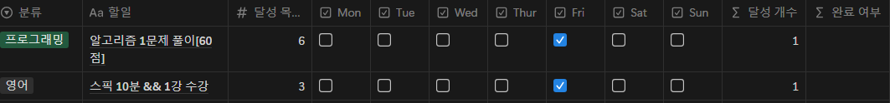

# 프로젝트 개요

Notion의 반복 일정 기능은 정해진 요일에만 일정을 진행하도록 돕지만, 한 주나 한 달 단위의 목표 관리에는 한계가 있다.  
본 프로젝트는 Notion API를 활용하여 주간 또는 월간 반복 일정을 자동으로 관리하고, 달성률 등 성과를 체계적으로 확인할 수 있도록 개발한다.

## 목적

- **반복 일정 자동 관리:** 매주 혹은 매달 반복되는 일정을 자동으로 업데이트하고 관리한다.  
- **주간 초기화:** 매주 특정 시간에 데이터베이스를 초기화하여 새로운 주의 일정을 시작한다.  
- **과거 데이터 백업:** 전 주의 데이터를 저장하여 부족한 부분을 보완하고 성과를 분석한다.  
- **달성률 관리:** 매주(또는 매월) 달성률을 기록하고 비교할 수 있도록 별도 데이터베이스에 저장한다.  

## 주요 기능

### 데이터 관리
- **현재 데이터:** 진행 중인 일정 데이터를 저장하는 메인 데이터베이스를 말한다.  
- **과거 데이터:** 이전 주의 데이터를 백업하고 임시 저장하는 데이터베이스를 말한다.

## 제한사항

1. **단일 데이터베이스 관리**  
   - 한 개의 데이터베이스를 주 데이터베이스로 설정하여 일정 관리를 진행한다.  
   - 각 페이지는 고유 ID를 가지고 있어, 이동이나 복제 등을 통한 관리가 용이하다.  
   - 별도의 데이터베이스 복사나 삭제 없이 관리한다.

2. **데이터베이스 이름 고정**  
   - Notion API로 데이터베이스 이름 변경이 어려워 “이번 주”, “이전 주” 등과 같이 고정된 이름을 사용한다.

3. **속성(컬럼) 이름 및 형식**  
   
   - “이름”은 반드시 스크린샷에 명시된 동일한 이름으로 유지한다.  
   - “완료 여부”는 체크박스(checkbox) 형식이어야 한다.  
   - 스크린샷에서 보여주는 속성 이름(예: “분류” 등)은 정확히 일치해야 하며, 필요에 따라 적절한 타입으로 설정한다.  
   - “달성 개수”와 “달성 목표”는 연산용 컬럼이므로 선택사항이다.

4. **달성률 데이터 관리**  
   - 매주 달성률은 별도의 달성률 관리 데이터베이스에 저장한다.

5. **임시 데이터 백업**  
   - Notion SDK - Python API로 새로운 데이터베이스 생성을 지원하지 않으므로, 한 주 데이터만 임시 저장한다.

## 시스템 구성 가이드

### Notion 연동 준비

- Notion 페이지에 본 Bot이 연결되어 있어야 하며, 관련 권한이 부여되어 있어야 한다.

### 환경 변수 설정 (.env)

- `NOTION_TOKEN`: Notion Secret Key  
- `CURRENT_DATABASE_ID`: 현재 데이터베이스 ID  
- `PAST_DATABASE_ID`: 주간 데이터를 백업하기 위한 데이터베이스 ID  
- `ACHIEVEMENT_DATABASE_ID`: 달성률을 저장할 데이터베이스 ID  
- **(선택 사항)** Slack 연동을 사용할 경우 추가 환경 변수(예: `SLACK_WEBHOOK_URL`)를 설정한다.

## 실행 방법

프로젝트는 Slack 연동 기능 사용 여부에 따라 두 가지 방식으로 실행한다.

- **Slack 연동 없이 실행**  
  ```bash
  python main.py
  ```

- **Slack 연동 기능 포함하여 실행**  
  ```bash
  python main_with_slack.py
  ```

---

### 기능 업데이트 내역

- **ver.1.0**
  - 현재 일정 데이터베이스 자동 초기화 기능 구현
  - 과거 데이터 백업 및 재작성 기능 추가
  - 달성률 관리 데이터베이스 제작

- **ver.1.0.1**
  - 모듈화 및 라이브러리 제작

- **ver.1.0.2**
  - Slack 메서드 추가 및 `main_with_slack.py` 파일 도입

- **ver.1.0.3**
  - `main_with_slack.py` 오류 발생 시 Slack 메시지 전송 기능 추가

- **ver.1.0.5**
  - 약 및 비타민 주간 루틴 추적 기능 추가
  - 데이터베이스 초기화 시 Slack으로 복약 여부 알림

- **ver.1.0.9**
  - 달성률을 Slack으로 전송하는 기능 추가 및 전송 포맷 업데이트
  - 기타 버그 수정

- **ver.1.1.1**
  - 달성률 출력 오류 수정 (기존 0.3% 출력 문제 해결)

- **ver.1.1.2 ~ ver.1.2.0**
  - **달성률 계산 오류 수정**  
    기존에 계산된 달성률(예: 33)이 Notion에서 100배 증폭되어 3300%로 표시되던 문제를 해결한다.  
    이제 달성률은 올바른 비율(예: 0.33 또는 상황에 따라 33%로 표시)로 나타난다.

## 참고 자료

- [Notion-py GitHub Repository](https://github.com/jamalex/notion-py)
- [How to work with the Notion API in Python - Python Engineer](https://www.python-engineer.com/posts/notion-api-python/)
- [Notion API & Python](https://thienqc.notion.site/Notion-API-Python-ca0fd21bc224492b8daaf37eb06289e8)
